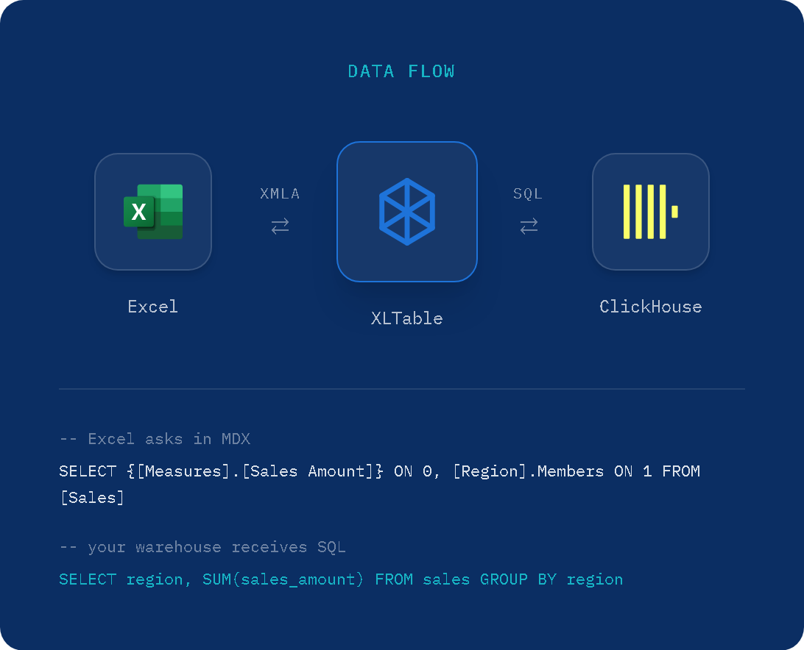

About XLTable
=============

**Semantic Layer for Big Data.**

Self-service analytics on big data — governed by IT, loved by users.

XLTable is an XMLA-compatible OLAP semantic layer that connects **Excel Pivot
Tables** and AI assistants directly to modern analytical databases — without
exporting data to files or using traditional BI tools. No SQL for end users,
no data copies: queries are pushed down to your warehouse, and XLTable
deploys inside your perimeter.

XLTable acts as a **semantic and security layer** between Excel and databases,
providing centralized control over data models, access rights and performance.

It is designed for organizations that want to keep Excel as the main
analytics tool while working with large datasets stored in modern data
platforms: Excel becomes the front end, your warehouse stays the single
source of truth.

------------------------------------------------------------

What is XLTable
---------------

XLTable enables business users to analyze large datasets using familiar
Excel Pivot Tables — or by asking questions in plain language through AI
assistants — while IT teams define and manage analytical models centrally.
One model, two ways to explore: Excel and AI answer from the same cube,
with the same numbers.

Unlike classic BI tools, XLTable does not replace Excel.
Instead, it extends Excel with enterprise-grade OLAP capabilities:

- Dimensions, measures and hierarchies
- Calculated fields and reusable metrics
- Fine-grained access control down to rows and members
- Query result caching
- Integration with Active Directory / LDAP
- MCP connector for Claude and other AI assistants

Cube definitions are plain SQL files: keep them in Git, review changes in
pull requests, deploy through the CI/CD flow your team already uses.

XLTable is typically used by finance teams, analysts, controllers and managers
who require both flexibility and governance.

------------------------------------------------------------

How it works (Architecture)
---------------------------

XLTable is positioned between Excel and analytical databases
and serves as an OLAP and semantic layer.

Excel connects to XLTable using the standard XMLA protocol.
XLTable receives MDX queries from Pivot Tables and translates them
into optimized SQL queries executed directly in the database.

Architecture flow
^^^^^^^^^^^^^^^^^

1. Excel sends analytical requests (MDX)
2. XLTable applies semantic model and security rules
3. SQL queries are generated and executed in the database
4. Results are cached and returned to Excel

This approach ensures that:
- All heavy computations stay inside the database
- Excel remains fast and responsive
- Business logic is defined once and reused consistently

------------------------------------------------------------

.. _ssas_comparison:

Comparison with SSAS
--------------------

The table below lists the main features of Microsoft SQL Server Analysis Services (SSAS)
and indicates which of them are available in XLTable.

.. list-table::
   :header-rows: 1
   :widths: 60 20 20

   * - Feature
     - SSAS
     - XLTable
   * - **Data Modeling**
     -
     -
   * - Multidimensional cubes (dimensions, measures, hierarchies)
     - ✓
     - ✓
   * - Tabular models (in-memory columnar)
     - ✓
     -
   * - Calculated measures (calculated fields)
     - ✓
     - ✓
   * - Named sets
     - ✓
     -
   * - KPIs (Key Performance Indicators)
     - ✓
     -
   * - Perspectives (virtual cube subsets)
     - ✓
     -
   * - Field display names (translations)
     - ✓
     - ✓
   * - **Query Languages**
     -
     -
   * - MDX (Multidimensional Expressions)
     - ✓
     - ✓
   * - DAX (Data Analysis Expressions)
     - ✓
     -
   * - XMLA protocol
     - ✓
     - ✓
   * - **Performance & Storage**
     -
     -
   * - Query result caching
     - ✓
     - ✓
   * - Partitions
     - ✓
     -
   * - Pre-computed aggregations
     - ✓
     - ✓
   * - Proactive caching
     - ✓
     - ✓
   * - DirectQuery (pass-through to source database)
     - ✓
     - ✓
   * - **Security**
     -
     -
   * - Role-based access control
     - ✓
     - ✓
   * - Row-level security
     - ✓
     - ✓
   * - Dimension security
     - ✓
     - ✓
   * - Active Directory / LDAP integration
     - ✓
     - ✓
   * - **Client Integration**
     -
     -
   * - Excel PivotTable connectivity
     - ✓
     - ✓
   * - Power BI connectivity
     - ✓
     -
   * - Management tools (SSMS)
     - ✓
     -
   * - Drillthrough (cell to detail rows)
     - ✓
     - ✓
   * - AI assistants connectivity (MCP)
     -
     - ✓
   * - **Administration**
     -
     -
   * - Full data processing (ETL-like refresh)
     - ✓
     -
   * - Incremental processing
     - ✓
     -
   * - Admin / monitoring interface
     - ✓
     - ✓

------------------------------------------------------------

Deployment steps
----------------

A typical XLTable deployment consists of several simple stages.
Most installations can be completed in less than one hour.

1. Prepare infrastructure
^^^^^^^^^^^^^^^^^^^^^^^^^

Prepare a Linux or Windows server according to system requirements.
XLTable can be deployed on-premise or in the cloud.

2. Install XLTable
^^^^^^^^^^^^^^^^^^

Install XLTable service and configure basic system settings.

3. Configure database connections
^^^^^^^^^^^^^^^^^^^^^^^^^^^^^^^^^

Define connections to analytical databases such as ClickHouse, Trino or Greenplum.
Connection settings are stored centrally.

4. Define OLAP cubes
^^^^^^^^^^^^^^^^^^^^

Create OLAP cube definitions using SQL-based configuration files.
Define dimensions, measures, calculated fields and access rules.

5. Connect Excel
^^^^^^^^^^^^^^^^

Connect Excel Pivot Tables to XLTable using XMLA
and start analyzing data immediately.

------------------------------------------------------------

.. _system_requirements:

System requirements
-------------------

XLTable is designed for enterprise environments
and supports both physical and virtual deployments.

Operating systems
^^^^^^^^^^^^^^^^^

- Linux (Ubuntu 22.04+ recommended)
- Windows 10 / 11
- Windows Server 2019+

Hardware requirements
^^^^^^^^^^^^^^^^^^^^^

Minimum:
- 4 CPU cores
- 16 GB RAM
- 50 GB disk space

Recommended:
- 8+ CPU cores
- 32 GB RAM
- SSD storage

Network requirements
^^^^^^^^^^^^^^^^^^^^

- Stable network connection between XLTable server and analytical databases
- Network access for Excel clients to XLTable server by 80 or 443 ports
- Access to Active Directory (optional)

System requirements may vary depending on data volume,
number of users and complexity of OLAP models.

------------------------------------------------------------

Testing and purchasing
----------------------
For testing and purchasing, contact us by email help@xltable.com or Telegram https://t.me/XLTable 
